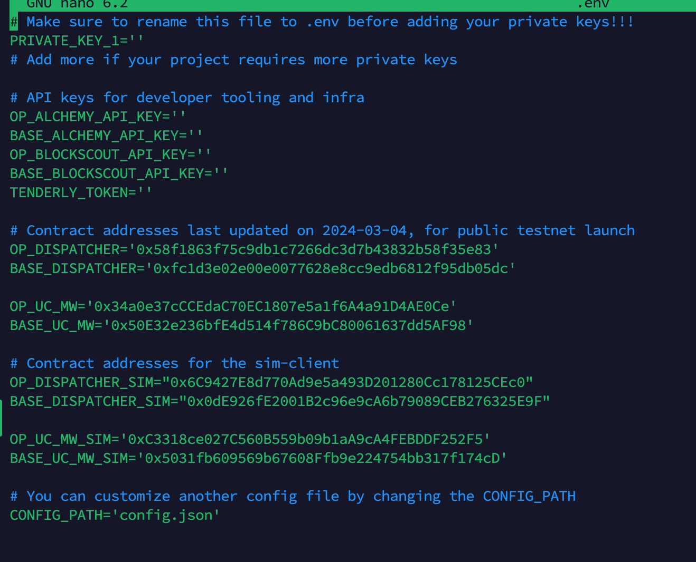

<p align="center">
   
</p>

Polymer Labs . Establishing the next generation of the internet, by scaling IBC interoperability to all blockchains. | [polymerlabs.org](http://polymerlabs.org)

## Use template

```
https://github.com/open-ibc/ibc-app-solidity-template/tree/main
```


## Installation Package

```
sudo apt-get update
sudo apt-get upgrade
apt install npm
sudo apt install git
```

## Install Node js

```
sudo apt install curl wget gnupg
curl -fsSL https://deb.nodesource.com/gpgkey/nodesource.gpg.key | sudo gpg --dearmor -o /usr/share/keyrings/nodesource.gpg
echo "deb [signed-by=/usr/share/keyrings/nodesource.gpg] https://deb.nodesource.com/node_18.x $(lsb_release -cs) main" | sudo tee /etc/apt/sources.list.d/nodesource.list
sudo apt update
sudo apt install nodejs
node --version
npm --version
```

## Install Foundry

```
curl -L https://foundry.paradigm.xyz | bash
foundryup 
```

## For VPS

```
source /root/.bashrc
```

## For Gitpod

```
source /home/gitpod/.bashrc
```

## Install Just Program

```
wget -qO - 'https://proget.makedeb.org/debian-feeds/prebuilt-mpr.pub' | gpg --dearmor | sudo tee /usr/share/keyrings/prebuilt-mpr-archive-keyring.gpg 1> /dev/null
echo "deb [arch=all,$(dpkg --print-architecture) signed-by=/usr/share/keyrings/prebuilt-mpr-archive-keyring.gpg] https://proget.makedeb.org prebuilt-mpr $(lsb_release -cs)" | sudo tee /etc/apt/sources.list.d/prebuilt-mpr.list
sudo apt update
sudo apt install just
```

## Create API Explorer OP and Base

```
https://optimism-sepolia.blockscout.com/account/api-key
```
```
https://base-sepolia.blockscout.com/account/api-key
```


## Create Alchemi API Key for OP and Base

```
https://docs.alchemy.com/docs/alchemy-quickstart-guide
```


## Configuration

```
git clone https://github.com/Dexanode/ibc-app-solidity.git
```

## *change with your repo template

```
cd ibc-app-solidity
```

## *change with your directory template

```
cp .env.example .env
```

```
nano .env
```

```
just install
```



```
PRIVATE KEY = 'FILL_YOUR_PRIVATE_KEY'
OP_ALCHEMY_API_KEY='FILL_YOUR_ALCHEMY_OP_KEY' 
BASE_ALCHEMY_API_KEY='FILL_YOUR_ALCHEMY_BASE_KEY' 
OP_BLOCKSCOUT_API_KEY='FILL_YOUR_EXPLORER_OP_API_KEY' 
BASE_BLOCKSCOUT_API_KEY='FILL_YOUR_EXPLORER_BASE_API_KEY'
TENDERLY_TOKEN='D0_NOT_FILL'
```

## Before Run make sure your address have faucet OP Sepolia and Base Sepolia, if you don`have faucet. get faucet in here :  

```
https://www.alchemy.com/faucets/optimism-sepolia
```

```
https://www.alchemy.com/faucets/base-sepolia
```

## Custom IBC channel

```
just do-it
```


### Done Packet has been sent!
### Check your channel IBC on https://sepolia.polymer.zone/packets


